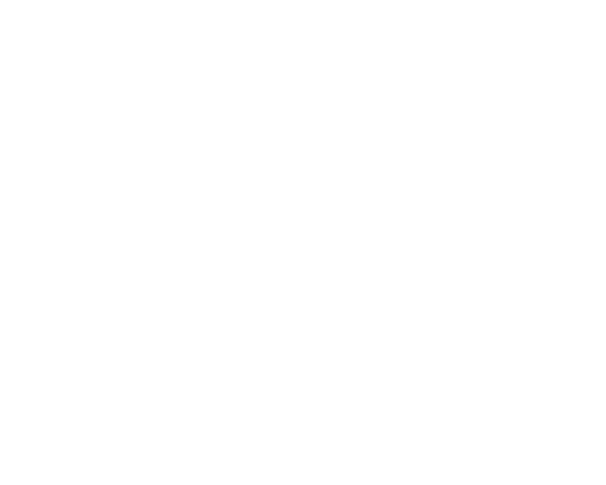

# Ayiah

<html>
    <body>
        
    </body>
</html>

Celestial (Ayiah), We're astral (Ayiou)

## 🚀 Features

- 🎬 **Multi-Media Support**: Stream and manage videos, music, novels, and comics in one platform.
- 📡 **RSS Subscriptions**: Automatically track and update your favorite TV shows, anime, novels, and comics.
- 🌐 **Network Sources**: Access and stream media directly from online sources and network locations.
- ⬇️ **External Downloader Integration**: Compatible with popular downloaders for automated media acquisition.
- 🔍 **Media Scraping**: Automatically fetch metadata and artwork for a polished library experience.
- 🏠 **Self-Hosted**: Full control over your data with easy deployment on your own server.
- 🖱️ **User-Friendly Interface**: Intuitive design for effortless navigation and media access.
- 📱 **Cross-Platform**: Accessible on web browsers, with planned support for mobile apps.

## 🛠 Tech Stack

**Backend**: Rust, Axum

**Frontend**: React, Vite, Tailwind CSS, HeroUI

**Database**: SQLite(With SeaORM)

**Deployment**: Pre-compiled, Docker

**CI/CD**: GitHub Actions

---

Happy media hosting with Ayiah! 🎥🎵📚
